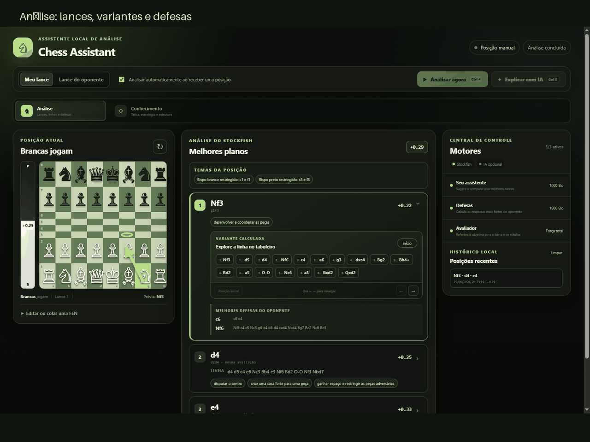
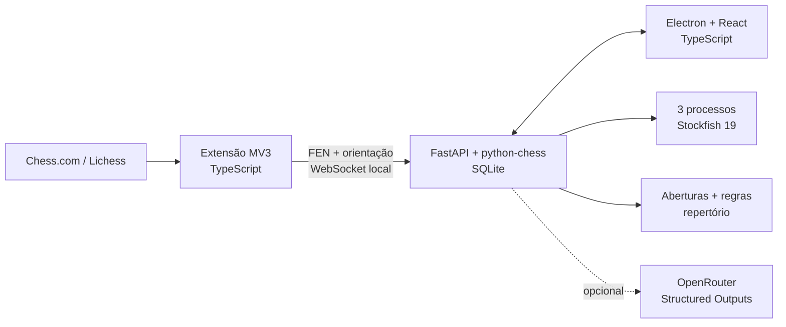

<p align="center">
  
</p>

<h1 align="center">Chess Assistant</h1>

<p align="center">
  Assistente desktop de análise enxadrística com Stockfish nativo, leitura do<br>
  Chess.com e Lichess e explicações fundamentadas em evidências do tabuleiro.
</p>

<p align="center">
  <a href="https://github.com/andrenv14/chess-assistant/actions/workflows/ci.yml">
    
  </a>
</p>

<p align="center">
  <a href="#produto">Produto</a> ·
  <a href="#arquitetura">Arquitetura</a> ·
  <a href="#engenharia">Engenharia</a> ·
  <a href="#executar-localmente">Executar</a> ·
  <a href="docs/PORTFOLIO.md">Case de portfólio</a>
</p>



## O projeto

O Chess Assistant conecta uma extensão leve do navegador a um aplicativo local.
A extensão lê a posição e a orientação do tabuleiro; o desktop concentra a
análise, a navegação das variantes e o conhecimento enxadrístico. Todo o cálculo
principal permanece no computador do usuário.

A arquitetura separa responsabilidades de forma explícita: **Stockfish decide
e avalia**, regras determinísticas descrevem o que existe no tabuleiro e a LLM,
quando configurada, apenas transforma essas evidências em texto natural. Uma
resposta bem escrita nunca pode alterar o ranking dos lances ou inventar uma
linha que o motor não calculou.

## Produto

O cockpit reúne as três informações necessárias para analisar uma posição sem
trocar de contexto:

- tabuleiro, orientação automática e barra de avaliação;
- melhores lances, centipawns, variantes navegáveis e defesa crítica;
- abertura, temas táticos, estrutura, segurança dos reis e planos estratégicos.

O Centro de Conhecimento abre visões próprias para panorama, tática, estratégia
e finais. A interface também classifica o lance depois que ele é jogado e
mantém histórico, perfis de força e preferências em SQLite local.

<table>
  <tr>
    <td width="50%">
      
      <br><sub><strong>Tática.</strong> Motivos concretos, alvos e linhas forçadas.</sub>
    </td>
    <td width="50%">
      
      <br><sub><strong>Estratégia.</strong> Planos dos dois lados e repertório especializado.</sub>
    </td>
  </tr>
  <tr>
    <td colspan="2">
      
      <br><sub><strong>Finais.</strong> Tipo de final, peões passados, oposição e atividade das peças.</sub>
    </td>
  </tr>
</table>

### Funcionalidades principais

| Área | Entrega |
|---|---|
| Análise | MultiPV, eval bar, SAN/UCI, centipawns, mate, linhas e respostas do oponente |
| Motores | Perfis independentes para o assistente, o oponente e o avaliador objetivo |
| Partida | Leitura ao vivo, orientação, reconstrução de FEN e classificação pós-lance |
| Conhecimento | Aberturas, tática, estratégia, estrutura de peões, segurança do rei e finais |
| Repertório | Sistema London, Siciliana Kan/Taimanov e Índia do Rei, para os dois lados |
| Explicações | Saída estruturada via OpenRouter, validada contra lances e evidências reais |
| Persistência | Perfis e histórico recente em SQLite, sem armazenar credenciais |

## Arquitetura



Cada função do motor possui processo e fila próprios. O assistente pode retornar
candidatos enquanto o avaliador classifica o lance anterior; a defesa da linha
selecionada é calculada pelo perfil configurado para o outro lado. A interface
recebe os resultados progressivamente, evitando que uma tarefa lenta bloqueie
todo o cockpit.

## Engenharia

### Decisões que orientam o projeto

- **Autoridade separada:** avaliação e ordem dos lances sempre pertencem ao
  Stockfish; a LLM não funciona como motor.
- **Evidência antes de prosa:** temas como cravada, ataque descoberto, atração e
  desvio carregam alvos verificáveis e testes negativos contra falsos positivos.
- **Força configurável por papel:** assistente e oponente podem usar Elo, Skill,
  tempo ou profundidade diferentes durante a mesma sessão.
- **Processamento local:** navegador, backend e desktop conversam apenas por
  loopback; nenhuma posição depende de um servidor próprio do projeto.
- **Entrega reproduzível:** o pipeline constrói o backend autocontido, gera o
  instalador, instala, analisa com Stockfish, verifica a extensão e desinstala
  em um Windows limpo.

### Números verificados

| Indicador | Resultado |
|---|---:|
| Candidatos com o processo aquecido | 504 ms |
| Candidatos durante classificação paralela | 505 ms |
| Posições no catálogo local de aberturas | 3.815 |
| Testes automatizados | 216 |
| Casos reais da regressão paga de explicações | 4/4 |

As medições foram feitas no host de desenvolvimento com perfis de 500 ms e são
apresentadas como observações, não como promessa para qualquer hardware. O
procedimento está em [`scripts/benchmark-engine.py`](scripts/benchmark-engine.py).

### Stack

| Camada | Tecnologias |
|---|---|
| Desktop | React 19, TypeScript, Vite, Electron |
| Extensão | TypeScript, Manifest V3, chess.js, WebSocket |
| Backend | Python, FastAPI, Pydantic, python-chess, SQLite |
| Motor | Stockfish 19 nativo; Maia-3 opcional |
| Explicações | OpenRouter/OpenResponses com Structured Outputs |
| Qualidade | Pytest, Vitest, Ruff, GitHub Actions, PyInstaller, NSIS |

## Executar localmente

### Requisitos

- Windows 10 ou 11;
- Node.js 22 ou superior;
- Python 3.11 ou superior.

### Ambiente de desenvolvimento

```powershell
git clone https://github.com/andrenv14/chess-assistant.git
cd chess-assistant

npm ci
python -m venv backend\.venv
backend\.venv\Scripts\python.exe -m pip install -e ".\backend[dev,package]"
.\scripts\install-stockfish.ps1

npm run dev:desktop
```

O Electron inicia e encerra o backend automaticamente. Para gerar a extensão:

```powershell
npm run build:extension
```

No Chrome ou Edge, abra a página de extensões, ative o modo de desenvolvedor e
carregue `apps/extension/dist` como extensão descompactada.

### Explicações opcionais

O Stockfish e todo o conhecimento determinístico funcionam sem chave de API.
Para habilitar a prosa da LLM, copie o arquivo de exemplo e configure uma chave
local do OpenRouter:

```powershell
Copy-Item backend\.env.example backend\.env
```

O modelo recomendado no exemplo é `google/gemini-3.1-flash-lite`. O arquivo
`backend/.env` é ignorado pelo Git e não entra no instalador.

### Testes e pacote Windows

```powershell
npm run typecheck
npm test
backend\.venv\Scripts\python.exe -m ruff check backend\app backend\tests backend\scripts
backend\.venv\Scripts\python.exe -m pytest backend\tests

npm run package:win
npm run qa:installer
npm run qa:live-extension
```

O instalador é gerado em `apps/desktop/release`. A versão local é funcional,
mas permanece sem assinatura Authenticode de um publisher confiável; por isso o
Windows pode exibir um aviso do SmartScreen.

## Organização do repositório

```text
apps/
  desktop/       interface React e processo Electron
  extension/     ponte Manifest V3 para Chess.com e Lichess
backend/         API, motores, conhecimento, persistência e explicações
packages/
  contracts/     contratos compartilhados em TypeScript
scripts/         build, benchmark, QA e empacotamento
docs/            decisões técnicas, evidências e case de portfólio
```

## Documentação

- [Case de portfólio](docs/PORTFOLIO.md) — problema, solução, experiência e resultados;
- [Arquitetura](docs/ARCHITECTURE.md) — processos, protocolos e limites entre componentes;
- [Conhecimento enxadrístico](docs/CHESS_KNOWLEDGE.md) — fatos, temas e planos detectados;
- [Contrato das explicações](docs/LLM_EXPLANATIONS.md) — grounding, validação e custos;
- [Revisão de release](docs/RELEASE_REVIEW.md) — problemas encontrados e provas de correção;
- [Empacotamento Windows](docs/PACKAGING.md) — backend autocontido, NSIS e assinatura;
- [Estado verificado](docs/STATUS.md) — escopo concluído e trabalho externo de ciclo de vida.

## Estado da distribuição

O produto local, o case de portfólio e o pipeline de release não assinada estão
completos. A distribuição pública com identidade verificada exige apenas um
certificado Authenticode externo. Mudanças futuras no DOM do Chess.com ou do
Lichess fazem parte da manutenção normal dos adaptadores.
