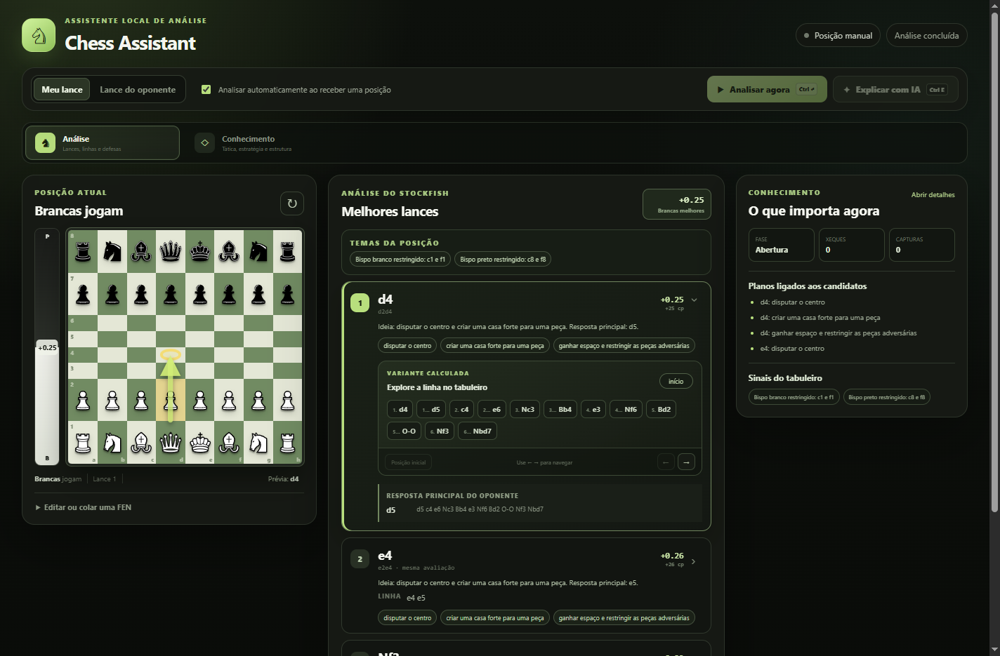
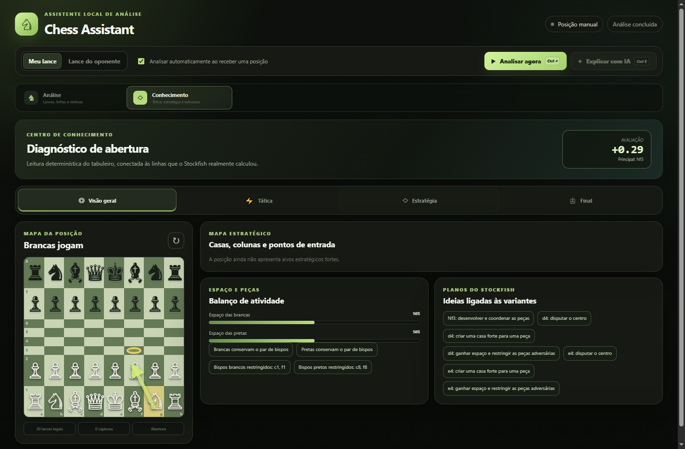
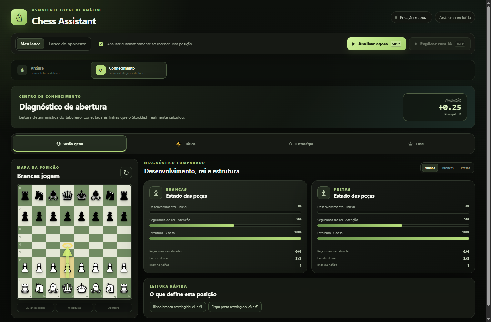
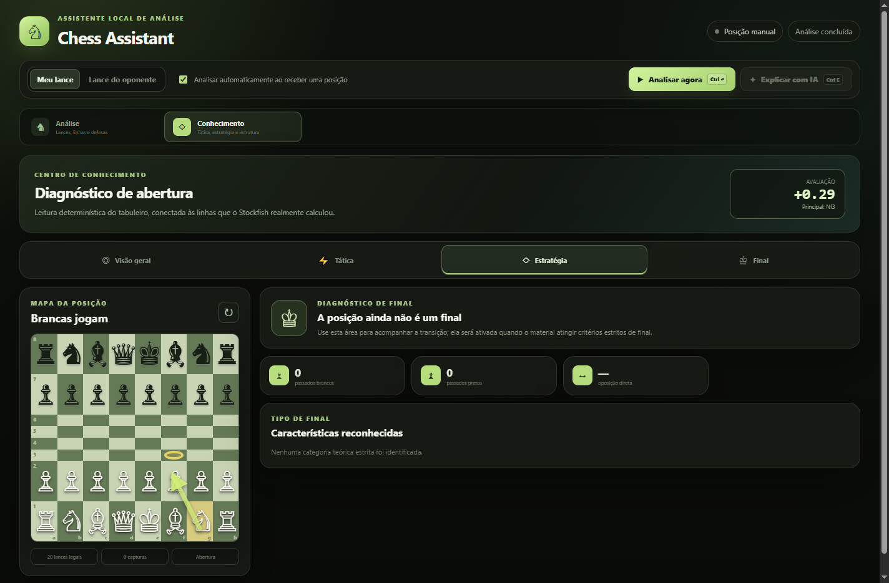

# Chess Assistant

**Assistente local de xadrez que conecta Chess.com/Lichess a múltiplos
Stockfish nativos, conhecimento determinístico e explicações estruturadas por
LLM — sem transformar o navegador no motor de análise.**



## O problema

Uma avaliação numérica sozinha não responde às perguntas úteis durante uma
análise: quais são as boas opções, por que funcionam, qual defesa é crítica,
qual plano continua a linha e o que a estrutura de peões ou a segurança dos
reis está dizendo. Ao mesmo tempo, pedir tudo diretamente a uma LLM cria risco
de prosa convincente sem sustentação enxadrística.

O projeto resolve isso separando autoridades:

- Stockfish escolhe e avalia os lances;
- regras determinísticas extraem fatos verificáveis do tabuleiro;
- uma base local identifica aberturas e um repertório focado fornece contexto;
- a LLM apenas transforma essas evidências em explicações naturais validadas;
- a extensão lê o estado do navegador e o app local continua dono de todo o cálculo.

## A experiência

O cockpit inicial reserva suas três colunas para o que importa no momento:
tabuleiro e eval bar, candidatos do Stockfish, e conhecimento da posição. As
configurações ficam em um painel secundário, não competindo com a análise.

Cada candidato mostra SAN, UCI, centipawns pela perspectiva das brancas,
diferença para a principal, plano detectado e variante navegável no tabuleiro.
A defesa da linha selecionada vem de outra instância do Stockfish, usando a
força configurada para o outro lado. Quando habilitado, o avaliador de força
total atualiza a barra sem atrasar os candidatos.



O Centro de Conhecimento abre espaço para panorama, tática, estratégia e
finais sem comprimir tudo em pequenos cards na página inicial. Os indicadores
de desenvolvimento, estrutura, espaço e segurança do rei são descrições do
tabuleiro; eles nunca substituem a avaliação oficial do motor.



## Arquitetura

```text
Chess.com / Lichess
        │ DOM + FEN + orientação
        ▼
Extensão TypeScript (Manifest V3)
        │ WebSocket em 127.0.0.1
        ▼
FastAPI + python-chess + SQLite
        ├── Stockfish “seu assistente”
        ├── Stockfish “oponente”
        ├── Stockfish avaliador
        ├── abertura + fatos + repertório
        └── OpenRouter / saída estruturada opcional
        │ HTTP + WebSocket
        ▼
Electron + React + TypeScript
```

Cada processo de motor tem sua própria fila. Isso mantém a comunicação UCI
segura, mas permite que o conselheiro responda enquanto o avaliador classifica
o lance anterior. A interface usa entrega progressiva: conhecimento barato e
candidatos primeiro, defesa selecionada e avaliação objetiva depois.

## Resultado de desempenho

Medição reproduzível no host de desenvolvimento, com Stockfish 19 e limites de
500 ms. Não é apresentada como promessa para qualquer hardware.

| Evento percebido | Medição |
|---|---:|
| Três candidatos com processo frio | 783 ms |
| Três candidatos com processo aquecido | 504 ms |
| Primeira defesa independente | 740 ms |
| Candidatos durante classificação paralela | 505 ms |

Na mesma execução, a classificação completa levou 1,93 s, mas deixou de
bloquear a lista de lances. O benchmark vive em `scripts/benchmark-engine.py`.

## Conhecimento enxadrístico

Além de 3.815 posições do catálogo CC0 do Lichess para nomenclatura de
aberturas, a primeira versão aprofunda três repertórios escolhidos:

- Sistema London de brancas;
- Siciliana com `...c5` e `...e6`, cobrindo ideias de Kan e Taimanov;
- Índia do Rei contra `1.d4` e ordens compatíveis de Réti/Inglesa.

Para cada um, o app reúne planos para os dois lados, rupturas, temas táticos,
armadilhas que exigem cálculo e linhas-modelo. A camada geral também identifica
material, mobilidade, colunas abertas e semiabertas, pares de bispos, outposts,
maiorias, peões passados/isolados/dobrados, pressão na zona do rei, peças
cravadas ou soltas e famílias de finais.



## Explicações com limites verificáveis

A LLM recebe um catálogo compacto de evidências produzido no servidor. A
resposta deve manter a quantidade e a ordem dos candidatos, citar IDs válidos
internamente e repetir exatamente uma defesa UCI quando ela for exigida. O
backend rejeita movimento inventado, promoção indevida de uma alternativa a
“melhor lance” e referências que não existam. Os IDs ficam escondidos; a UI
mostra texto natural e um selo de sustentação.

Essa separação também controla custo: pedir explicação reaproveita a evidência
já calculada e não repete o Stockfish. Sem chave ou crédito, todas as funções
determinísticas e do motor continuam disponíveis.

## Engenharia e qualidade

- monorepo TypeScript/Python com contratos compartilhados;
- 129 testes rápidos de backend e 10 integrações com Stockfish real;
- 49 testes do desktop, 26 da extensão e 2 dos contratos compartilhados;
- 216 testes automatizados no total, além dos smokes do pacote, instalador e
  extensão compilada;
- logs JSON sem FEN completa, prompts ou credenciais;
- SQLite local para perfis e histórico limitado;
- builds e typechecks reproduzíveis em CI;
- backend Python empacotado, Stockfish oficial incluído com licença e fonte;
- instalador NSIS, teste de instalação/desinstalação e extensão compilada;
- capturas automatizadas a 100% e 150% de escala do Windows.

A revisão de release com problemas encontrados, correções e limites está em
[`RELEASE_REVIEW.md`](RELEASE_REVIEW.md). A documentação técnica cobre
arquitetura, classificação, conhecimento, LLM, adaptadores, persistência,
testes e empacotamento separadamente.

## Stack

**Frontend:** React 19, TypeScript, Vite, Electron e Vitest.  
**Extensão:** TypeScript, Manifest V3, `chess.js` e WebSocket local.  
**Backend:** Python 3.11+, FastAPI, Pydantic, `python-chess`, SQLite e Pytest.  
**Motores:** Stockfish 19 nativo; Maia-3 permanece opcional.  
**Explicações:** API compatível com OpenResponses via OpenRouter, com Structured Outputs.

## Como demonstrar

No Windows, o caminho mais curto é instalar o executável em
`apps/desktop/release/Chess-Assistant-0.1.0-Setup.exe`, abrir o app e carregar
`apps/extension/dist` como extensão descompactada no Chrome ou Edge. O README
mantém também o fluxo completo de desenvolvimento e todos os comandos de QA.

## Limites assumidos

O case e a distribuição local não assinada estão completos e são verificados
em Windows limpo pela CI. Ele não é apresentado como uma distribuição comercial
assinada: isso ainda exige um certificado Authenticode de um emissor confiável.
Mudanças futuras no DOM dos sites exigirão manutenção dos adaptadores, e a
primeira entrada no meio de uma partida mantém as limitações históricas
documentadas para reconstruir direitos de roque apenas a partir das peças.
